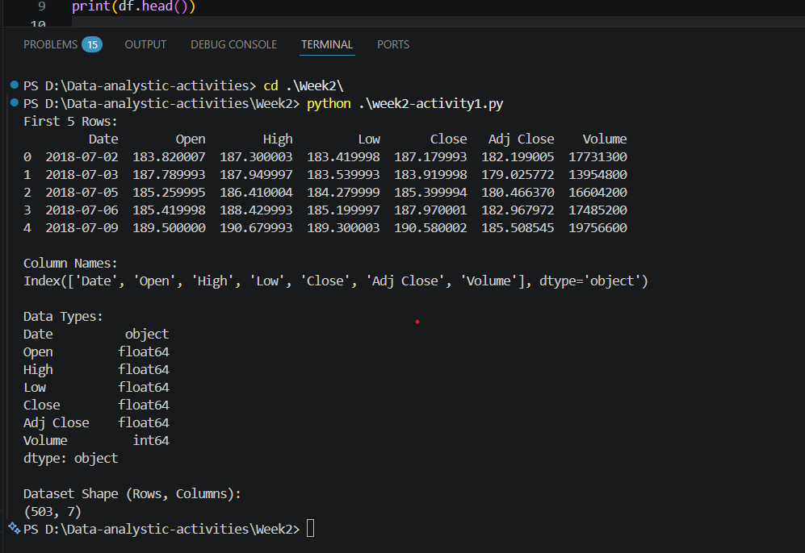

# Task 1 - Descriptive Analysis

## Dataset Overview

The dataset is loaded using Pandas and analyzed to understand its structure.

## Steps Performed

- Loaded dataset using pandas
- Displayed first 5 rows
- Identified column names and data types
- Counted total rows and columns

## Tools Used

- Python
- Pandas
- VS Code

## Output Screenshot

## Files Included

- data.csv
- week2-activity1.py
- README.md
- outcome_view.png
